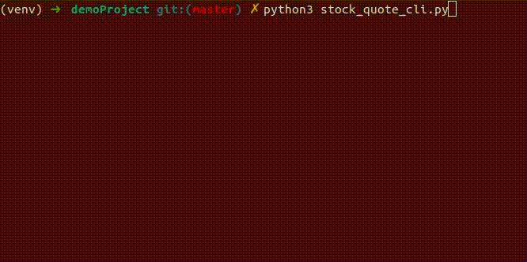

## Retrieve & Record Stock Quote Data

This is a CLI tool that allows uses to search for a publicly traded company's current stock information. The tool also has the ability to save current data by appending it to a csv file in order to build a historical record of stock performance over time. 


 
### To Install & Run:
 - Generate your [Finnhub API](https://finnhub.io/docs/api#authentication) token
 - Add token as follows into a `.env` file at project root:
 ```
FINNHUB_KEY=<my-api-auth-token>
```
```
git clone
touch .env
source /venv/bin/activate
pip3 install -r requirements.txt
python3 stock_quote_cli.py
deactivate
```